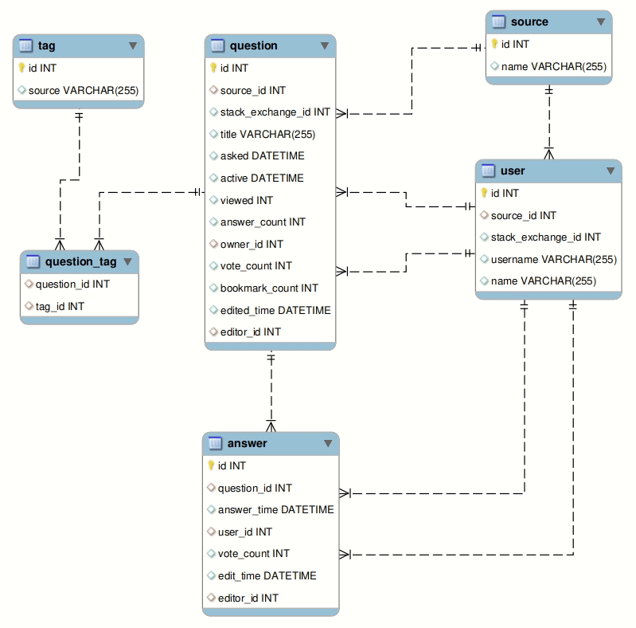

# Stack Exchange Scraper  

An easy and quick **python script** to extract data from question of the 
[Stack Exchange](https://stackexchange.com/) network sites. Right now support question from 
[Stack Overflow](https://stackoverflow.com/), [Ask Ubuntu](https://askubuntu.com/) 
and [Mathematics Stack Exchange](https://math.stackexchange.com/).

## Motivation
This project born as part of the **Data Mining** project for **ITC Class of Fall 2020**. The [Stack Exchange](https://stackexchange.com/) 
family sites are a meeting point between people who have questions on a related topic and other users and experts who freely answer their questions. 
The voting system allows us to follow the most popular questions and answers and gives us an idea of the trending topics in a specialized communities.
In summary it's a rich source of information that is regularly updated, ideal for **scraping**.

## Installation

For now just **clone** the repo. If you want you can use the provided `requeriment.txt` file to set your virtual environment.

To set your virtual environment follow this commands from the project directory.

```bash
python -m venv your_venv
source your_venv/bin/activate
pip install -r requirements.txt
```

To create the database you can run the following script

```bash
python3 ./create_database.py
```

By default the name of the database is `stack exchange`. 
You can change the name of the database and other database params modifying the `config.py` file.
## Usage
You can set options using the main notation standards:

**-s --search** tag

The `stack-scraper.py` command extract question and answers from the [FAQ](https://en.wikipedia.org/wiki/FAQ) list of one  the specified site. The usage is the following.

```bash
stack-scraper.py [-h] [-t TAG] [-w {SO,MATH,UBUNTU}] [-d DIRECTORY] [-b BEGIN] [-l LIMIT] [-f] [-s] [-v]
```

Some example executions:

```bash
python stack-scraper.py -t python
python stack-scraper.py -w MATH -t calculus
python stack-scraper.py -w UBUNTU -t cloud -d ~/temp -f
python stack-scraper.py -t sql -d ./temp -f -l 5000 -v
python stack-scraper.py -w SO -t sql -l 5000 -s
```

## Options

The program runs as a **command-line script**. Below you can see the list of available options. 
You can always go back to them using the `--help` flag.

```bash
python stack-scraper.py --help

usage: stack-scraper.py [-h] [-t TAG] [-w {SO,MATH,UBUNTU}] [-d DIRECTORY] [-b BEGIN] [-l LIMIT] [-f] [-s] [-v]

Performs a scraping on a web page of the Stack Exchange network saving the information of the questions in a csv file

optional arguments:
  -h, --help            show this help message and exit
  -t TAG, --tag TAG     the tag to specify the topic of the search. If it is not specified, it will search within the general FAQ
  -w {SO,MATH,UBUNTU}, --where {SO,MATH,UBUNTU}
                        the target website. -SO: https://stackoverflow.com -MATH: https://math.stackexchange.com -UBUNTU: https://askubuntu.com
  -d DIRECTORY, --directory DIRECTORY
                        the directory path where the results will be saved. If it does not exist, it will be created
  -b BEGIN, --begin BEGIN
                        the page number to start the search
  -l LIMIT, --limit LIMIT
                        the maximum number of questions to retrieve
  -f, --file            save the data in a CSV file
  -s, --save            save the data in the database (the database must exist before)
  -v, --verbose         determines if the program execution is displayed by CLI
```

Here are the options in more detail:

- `-h --help` show help.
- `-t --tag` search tag. specify the topic of the search. If it is not specified, it will search within the general **FAQ**.
- `-w --where` website to parse 
    - **SO**: [Stack Overflow](https://stackoverflow.com/) (by default)
    - **MATH**: [Mathematics Stack Exchange](https://math.stackexchange.com/).
    - **UBUNTU**: [Ask Ubuntu](https://askubuntu.com/) 
- `-d --directory` save directory 
- `-b --begin` the page number to start the search
- `-l --limit` the number of questions to retrieve
- `-v --verbose` if the program execution is displayed by CLI
- `-f --file` save the data in a CSV file
- `-s --save` save the data in the database (the database must exist before)


## Database
The following is the ERD diagram of the database.



Below you can find a description of the tables and their columns:
- **source**: The source is the stackExchange domain that Question and User belongs
    - `id`: PRIMARY KEY, INT auto incremental
    - `name`: VARCHAR, Domain from stackExchange
- **user**: A user from some stackExchange domain
    - `id`: INT, auto incremental
    - `source_id`: FOREIGN KEY, INT, id of the source (stackExchange domain)
    - `stack_exchange_id`: INT, id of the user in source
    - `username`: VARCHAR, username of the user in source
    - `name`: VARCHAR, name of the user in source
- **tag**: A tag for a question
    - `id`: PRIMARY KEY, INT auto incremental
    - `name`: VARCHAR, name of the tag
- **question**: A question from stackExchange domain
    - `id`: INT, auto incremental
    - `source_id`: FOREIGN KEY, INT, id of the source (stackExchange domain)
    - `stack_exchange_id`: INT, id of the user in source
    - `title`: VARCHAR, title of the question
    - `asked`: DATETIME, when the question was asked
    - `active`: DATETIME, since when the question are active
    - `viewed`: INT, number of visits
    - `answer_count`: INT, number of responses
    - `owner_id`: FOREIGN KEY, INT, id of the user who asked the question
    - `vote_count`: INT, number of votes (sum of negative and positive votes)
    - `bookmark_count`: INT, number of times in which the question has been marked
    - `edited_time`: DATETIME, the last time the question was edited
    - `editor_id`: FOREIGN KEY, INT, id of the user who edited the question
- **answer**: A answer from stackExchange question
    - `id`: INT, auto incremental
    - `question_id`: FOREIGN KEY, INT, id of the question to which the answer belongs
    - `answer_time`: DATETIME, when the answer was posted
    - `user_id`: FOREIGN KEY, INT, id of the user who post the answer
    - `vote_count`: INT, number of votes (sum of negative and positive votes)
    - `edited_time`: DATETIME, the last time the answer was edited
    - `editor_id`: FOREIGN KEY, INT, id of the user who edited the answer
- **question_tag**: Intermediate table to support the many-to-many relationship between tag and user
    - `question_id`: COMPOSITE PRIMARY KEY, FOREIGN KEY, INT, id of the question
    - `tag_id`: COMPOSITE PRIMARY KEY, FOREIGN KEY, INT, id of the tag

## Test it
If you just want to test the execution of the program you can run the `test.py` script. 
It will recover the top 1000 favorite questions in the [Stack Overflow](https://stackoverflow.com/) under the `python` tag, 
shows the execution in the CLI and save the results in a .csv file on the the `./test` directory.

```bash
python test.py
```
## Screenshots

Example of a verbose execution:


\
Example of a non verbose execution:


**-w --where** website to parse 
* SO: stackoverflow (by default)
* MATH: math.stackexchange
* UBUNTU: ask.ubuntu

**-d --directory** save directory
```bash
python main.py -s python
python main.py -w MATH -s calculus
python main.py -w UBUNTU -s cloud -d c:/temp
```
## Contributing
Pull requests are welcome (especially from tutors). For major changes, please open an issue first to discuss what you would like to change.

## Team

[](https://github.com/regCode)  | [](https://github.com/CyberMaryVer)
---|---
[David Frankenberg](https://github.com/regCode) | [Maria Startseva](https://github.com/CyberMaryVer)

## License
**Stack Exchange Scraper** is released under the [MIT License](http://www.opensource.org/licenses/MIT).
